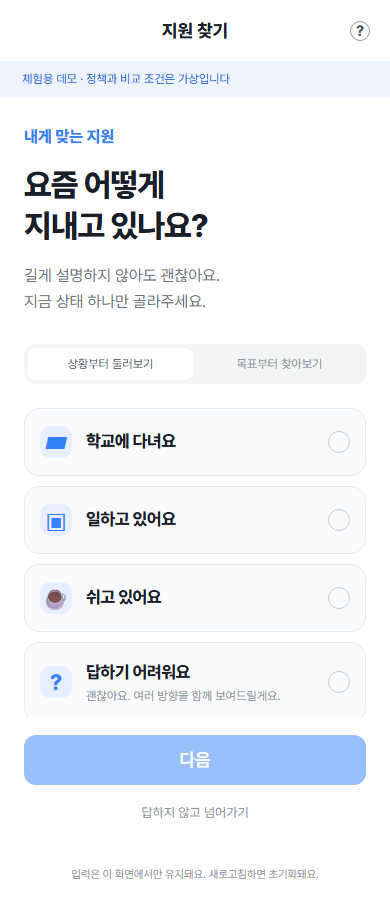
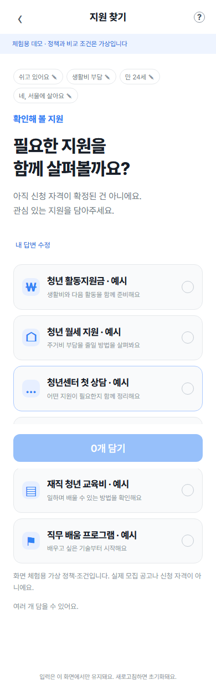
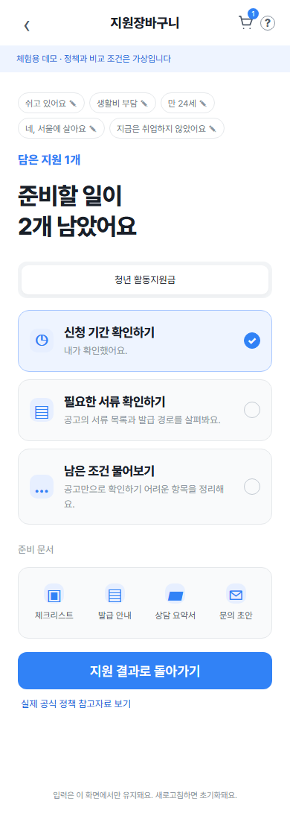
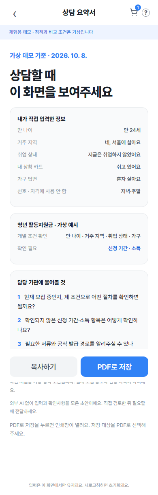

# 지원장바구니: 청년정책 AI 에이전트

**상황 카드에서 필요한 질문, 지원 후보와 조건 확인, 준비·상담 행동까지 이어가는 서비스**

[공개 데모](https://jiwon-basket.vercel.app/) · [데모 사용 안내](docs/demo/README.md) · [개발자 실행 안내](docs/getting-started/README.md) · [구조와 데이터 흐름](docs/architecture.md) · [API 규격](docs/api/intake-v1.md) · [개발·검증 계획](docs/development-plan.md)

공개 데모는 로그인 없이 열리는 **가상 정책·조건 체험**입니다. 로컬 FastAPI는 실제 정책 SQLite를 읽어 같은 화면에 응답합니다. 공개 정적 데모에서는 Python API와 실제 정책 DB를 사용하지 않습니다. 최종 자격과 현재 모집 여부는 공식 공고·기관에서 확인합니다.

## 서비스 화면

[지원장바구니 데모 열기](https://jiwon-basket.vercel.app/)

<table>
  <tr>
    <th>1. 상황 카드로 시작</th>
    <th>2. 필요한 지원 살펴보기</th>
  </tr>
  <tr>
    <td valign="top"></td>
    <td valign="top"></td>
  </tr>
  <tr>
    <th>3. 담은 지원의 신청 준비</th>
    <th>4. 상담 요약과 문서 저장</th>
  </tr>
  <tr>
    <td valign="top"></td>
    <td valign="top"></td>
  </tr>
</table>

실제 브라우저 캡처이며 정책·조건과 입력값은 **가상 체험 예시**입니다. [캡처 출처](assets/screens/README.md)

## 주요 기능

상황·관심 카드, 기초 질문, 지원 후보, 선택적 상세 확인, 장바구니 준비와 상담 요약을 연결합니다. 화면은 HTML/CSS/JavaScript로 구현했으며 Pretendard 글꼴을 함께 제공합니다. [글꼴 출처·라이선스](docs/demo/fonts.md)

- 모름·건너뛰기, 답변 수정, 상세 거절·중단·복귀, 오류 후 재시도
- 조건별 확인됨 / 미충족 / 확인 필요 / 입력 부족 표시와 명확한 미충족 후보 제외
- 메모리 장바구니, 준비 체크, 상담 요약·체크리스트·발급 안내·문의 초안
- 문서 복사와 브라우저 인쇄를 통한 PDF 저장
- 실제 제도 6개의 별도 공식 참고자료: ID·URL·확인일·기간 주의사항 표시

상황 카드에서 미취업·소득·경제난을 추정하지 않고, 선호를 자격 조건으로 사용하지 않습니다. 가상 정책의 조건과 공식 참고자료는 별개입니다. 입력·장바구니·완료 체크는 새로고침하면 초기화됩니다. 문서 초안은 입력과 확인사항을 조합하며 외부 AI 호출·자동 제출·예약·연락을 수행하지 않습니다.

## 사업기간 개발·검증 계획

현재 **G1 Foundation(기반 구축)을 완료**했습니다. [`v0.1-mvp`](https://github.com/yurimakes/youth-policy-llm-recommender/tree/v0.1-mvp)의 정책 수집·정규화·SQLite·조건 평가·임베딩/FAISS 검색·LLM 설명·Streamlit 기반을 유지하고, 데모·로컬 API와 회귀 검증을 갖췄습니다. 다음 단계는 **G2 정책 데이터·규칙 검증**이며, 아래는 2026년 10월부터 12월까지의 고도화 목표입니다.

| 시기 | 데이터·서비스 범위 | 구현·검증 목표 |
|---|---|---|
| 10월 | 서울·경기 지역 정책과 전국 공통 정책 | 초기 정책 20–30개 적재·근거 추적, 기본 추천·상세 조건 확인, 규칙·진행 기준선 검증 |
| 11월 | 이용허락이 확보된 전국 지역 정책 순차 확대 | 지역별 조건 판정, 최소 질문 개인화, 근거 검색·준비·상담 문서 생성 검증 |
| 12월 | 전국 거주 청년 대상 웹/PWA | 실제 정책 API 배포, 모바일·오류 복구·응답시간·비용·사용성 검증과 재평가 |

| Gate | 상태 | 범위·완료 기준 |
|---|---|---|
| **G1 Foundation** | **완료** | 기존 MVP 데이터·규칙·검색·설명·UI 기반, 데모·로컬 API 연결과 회귀 검증 |
| **G2 Data & Core QA** | 고도화 목표 | 정책 범위·필드 coverage·원본 추적, 정답 사례 100건 이상, 명확한 제외 누락·미확인 조건 충족 단정 0건 |
| **G3 Question** | 고도화 목표 | 같은 필수조건 확인 수준에서 질문 수 감소, 중복·추정·무동의 상세 진입 차단 |
| **G4 Evidence** | 고도화 목표 | 키워드 기준선보다 검색 개선, 핵심 안내 근거 일치율 95% 이상, 근거 없는 금액·기간·서류 생성 0건 |
| **G5 Release** | 고도화 목표 | 공개 API·timeout·fallback·웹/PWA·사용성 검증 통과, 비용·응답시간 예산과 릴리스 버전 고정 |

G1에서 구축한 기반을 재사용하며 앞 Gate의 통과 증빙을 갖춰야 다음 Gate의 구현·검증을 시작합니다. G2–G5의 수치와 전국 확대는 목표이며 달성 실적이나 전국 모든 정책 확보를 뜻하지 않습니다. [상세 개발 범위·Gate·평가 방법·릴리스 기준](docs/development-plan.md)

## 실행 안내

설치 없이 [공개 데모](https://jiwon-basket.vercel.app/)를 체험할 수 있습니다. 직접 실행하려면 **[`docs/getting-started/README.md`](docs/getting-started/README.md)**에서 환경 준비, 가상 데모, 실제 정책 데이터·API, 기존 Streamlit MVP와 테스트 방법을 확인하세요.

기존 MVP는 정책 수집·SQLite·조건 평가·OpenAI 임베딩/FAISS 검색·LLM 설명과 AI 실패 폴백을 제공합니다. [원본 MVP 안내](docs/mvp/overview.md)

## 검증

[GitHub Actions의 Demo checks](https://github.com/yurimakes/youth-policy-llm-recommender/actions/workflows/demo-checks.yml)는 Windows Python 회귀, JavaScript 시나리오, 정적 빌드와 Chromium 브라우저 흐름을 검사합니다. 실행별 결과와 화면 PNG·상담 PDF는 해당 실행에서 확인합니다. 브라우저 검증은 합성 정책과 합성 입력을 사용하며 실제 공고의 최신성이나 최종 자격을 보증하지 않습니다. [브라우저 검증 방법](docs/demo/README.md#자동-브라우저-검증과-캡처)

## 코드와 문서

| 경로 | 역할 |
|---|---|
| `app.py` | Streamlit MVP |
| `api.py` | 데모와 API를 제공하는 FastAPI 진입점 |
| `demo/` | 로컬 API 모드와 공개 가상 체험 모드 |
| `src/youth_policy/` | 데이터·조건 평가·검색·설명·진행 상태 모듈 |
| `scripts/` | 정책 수집·적재, API 점검, 정적 빌드, 스키마 생성 |
| `tests/` | 회귀 테스트와 브라우저 시나리오 |
| `docs/getting-started/` | 환경 준비·데이터 준비·실행·테스트 안내 |
| `docs/api/` | API 규격과 JSON Schema |
| `docs/demo/` | 데모 실행 안내와 글꼴 라이선스 |
| `assets/screens/` | 서비스 화면 캡처 |

## 데이터와 이용 조건

주요 출처는 [온통청년](https://www.youthcenter.go.kr/) 청년정책 API입니다. 정책 ID·공식 URL·확인 시각을 보존합니다. `last_verified_at`은 적재·처리 시각이며 담당 기관이 모든 조건을 재확인했다는 뜻이 아닙니다. 최종 자격과 현재 모집 여부는 공식 공고와 담당 기관에서 확인합니다.

API 키·raw 데이터·로컬 DB·사용자 답변은 공개 저장소에 포함하지 않습니다. 공식 데이터의 이용·재배포 조건과 코드 라이선스는 별도로 확인해야 하며 현재 코드 라이선스는 지정되지 않았습니다.
